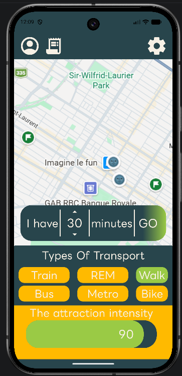
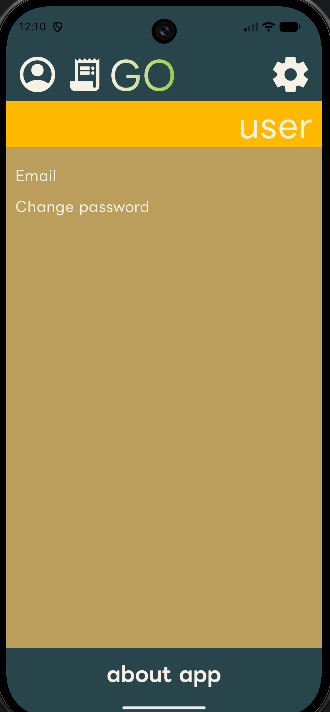
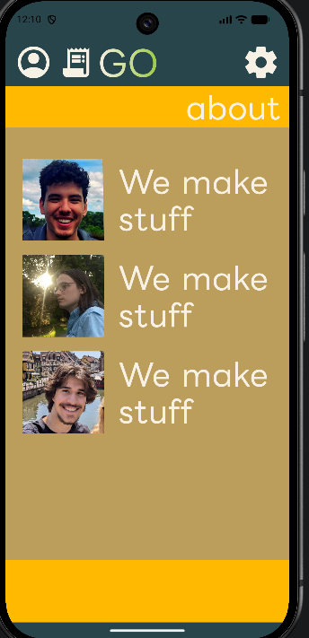

# RNDTransitMTL

## Goal

RNDTransitMTL is a Kotlin Multiplatform discovery app for Greater Montréal. Its goal is to generate semi-random adventures based on the user's available time, transportation choices, and interests, helping them explore unfamiliar places without choosing a destination first.

The current prototype includes a sample map, trip controls, transport selection, and Profile, About, Settings, and History navigation. See the [main design document](docs/MainDesignDoc.md) for the planned features.

## Quick-start

### Requirements

- Android Studio with support for the project's Android Gradle Plugin version, listed in `gradle/libs.versions.toml`.
- JDK 21 selected as the Gradle JDK.
- Android SDK Platform 37 and Android SDK Platform-Tools.
- An Android emulator or device running Android 7.0 / API 24 or newer.
- Internet access for the first dependency download.

### Get the source

```powershell
git clone https://github.com/NewWaveOwl/RNDTransitMTL.git
cd RNDTransitMTL
```

Open this repository folder in Android Studio, let Gradle sync, and install any requested SDK components. Use the included Gradle wrapper; a separate Gradle installation is not required.

### Build and launch Android

Select the `androidApp` run configuration and an emulator or connected device, then click **Run**. This builds and installs the debug version from source.

Alternatively, from the repository root in PowerShell, with a device or emulator connected:

```powershell
.\gradlew.bat :androidApp:installDebug
adb shell am start -n com.example.rnd_transit_mtl/.MainActivity
```

For a physical device, enable USB debugging. If `adb` is not on your PATH, run it from your Android SDK's `platform-tools` folder.

### Build and launch a release

Build the release variant from source:

```powershell
.\gradlew.bat :androidApp:assembleRelease
```

The output is in `androidApp/build/outputs/apk/release/`. The project currently has no release signing configuration, so this command produces an unsigned APK.

To create an installable release, use Android Studio's **Build → Generate Signed Bundle / APK**, choose **APK** and the `androidApp` module, create or select a signing key, and choose the **release** variant. Install the resulting signed APK on your device, then launch RNDTransitMTL from the app launcher. You can also install and launch it using:

```powershell
adb install -r "PATH_TO_SIGNED_RELEASE_APK"
adb shell am start -n com.example.rnd_transit_mtl/.MainActivity
```

Replace `PATH_TO_SIGNED_RELEASE_APK` with the actual signed APK path. When switching from a debug build to a release signed with a different key, uninstall the debug app first; uninstalling removes its local app data.

### Other platforms

From the repository root:

- Desktop: `.\gradlew.bat :desktopApp:run`
- Web with Wasm: `.\gradlew.bat :webApp:wasmJsBrowserDevelopmentRun`
- Web with JavaScript: `.\gradlew.bat :webApp:jsBrowserDevelopmentRun`
- iOS: on macOS, open `iosApp/iosApp.xcodeproj` in Xcode, select a simulator or device, and run the app.

On macOS or Linux, use `./gradlew` in place of `.\gradlew.bat`.

## Screenshots of application

### Main map and trip controls



### User profile



### About



These are the screenshots currently available in the repository. Screenshots for the Settings and History placeholders are still to be added.

## Team members

- Artiom Sova
- Caio Nunes
- Jimmy Rashid
