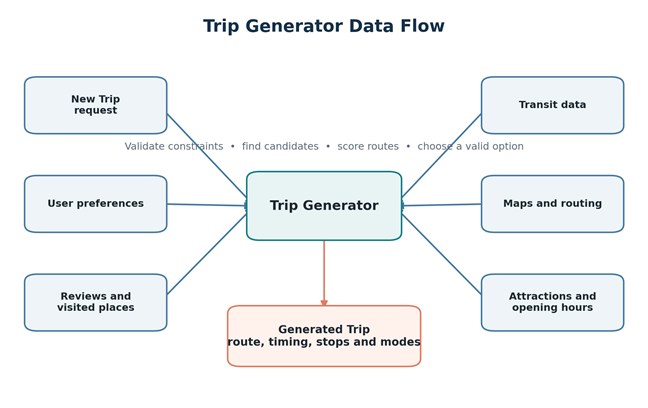
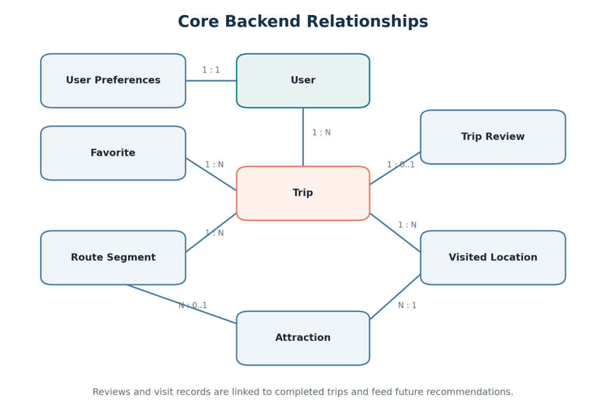
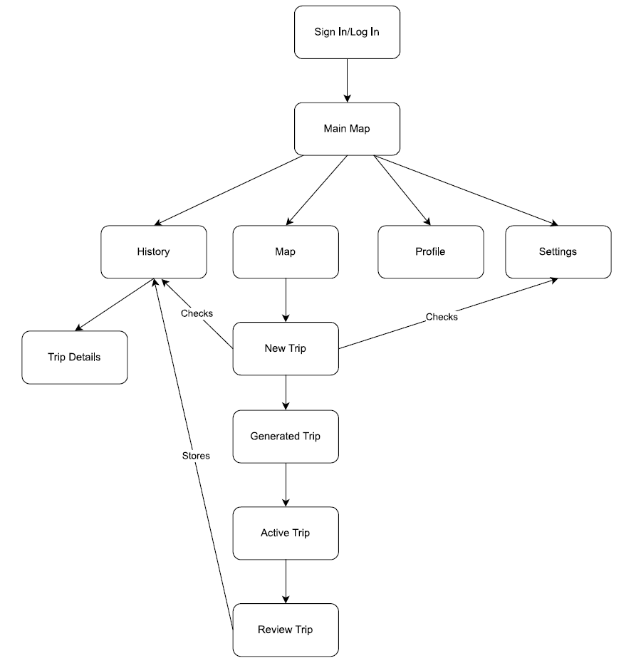

# TransitRandomizer Greater MontrГ©al Design Document

**Team:** Jimmy, Caio, Artiom  
**Project:** RNDTransitMTL  
**Updated:** 2026-10-02

TransitRandomizer generates achievable, semi-random adventures around Greater MontrГ©al using the user's available time, location, transportation choices, interests, and previous feedback. The user chooses what kind of adventure they want; the application proposes a destination and a practical route instead of requiring a destination in advance.

This document defines the product concept, screen behavior, generation algorithm, data model, and proposed delivery sequence. It combines the original Word design document with the team's additional feature ideas and the current Figma interface decisions. Planned features below are requirements and proposals, not a claim that they are already implemented.

## Product purpose

The application helps people answer questions such as “Where can I explore in the next two hours?” or “What unfamiliar place can I reach using Metro and walking?” It combines local discovery, route planning, personalization, and controlled randomness.

The intended users include MontrГ©al residents, students seeking inexpensive activities, tourists, pedestrians, cyclists, public-transit users, and groups of friends. A useful adventure should fit the available time, match interests, avoid unnecessary repetition, and remain practical to complete.

Walking, bicycle, bus, Metro, train, and REM are planned transportation options. Car support remains an open decision. Several modes may be combined in one adventure. A **trip leg** means a section of the journey, regardless of its mode; walking is a transportation mode rather than a synonym for a leg.

## Feature scope

| Feature | Intended behavior | Scope |
| --- | --- | --- |
| Random trip generator | Select reachable candidate places, compare them with time, interests, and transport preferences, and return a destination with a route | Core |
| Adventure categories | Let users decide what the adventure is about before generation | Core |
| User preferences | Store interests, transport choices, exploration level, and restrictions; use changes in subsequent generation | Core |
| Trip history | Save generated and completed trips, display their routes on the map, and allow an editable version of a past trip | Core |
| Post-trip review | Offer a star rating and short written review, plus feedback on individual places and route sections | Core |
| Map and compass views | Offer full map navigation or a minimal direction-only adventure view | Planned adventure feature |
| Shake to open compass | Open the compass when the user shakes the phone during an active adventure | Planned adventure feature |
| Topographic main map | Show terrain and elevation; let users target altitude ranges or viewpoints during hikes | Planned map feature |
| Local group adventures | Let nearby participants share an adventure and see group members on the map | Planned multiplayer feature |
| User-selected points of interest | Accept a list of places that influences the generated adventure path | Nice to have |
| Shared quests and competition | Give groups a shared quest pool for cooperative or competitive games inspired by Jet Lag | Nice to have |

The proposed first release prioritizes a complete single-user journey through generation, preview, completion, history, and review. Compass, elevation, and group features remain part of the product design, with their delivery order described later.

## Main user journey

1. The user launches the application. The entry flow supports a guest path; login and registration can be added when account services are available.
2. The user arrives at the main map and chooses their available time, transport modes, and adventure categories.
3. The user adjusts trip-specific settings or accepts their saved preferences.
4. GO requests a generated adventure using the current settings and location.
5. The preview shows a destination or sequence of stops, route, duration, distance, and transportation methods.
6. The user starts the adventure, regenerates it, edits the settings, or saves it for later.
7. During the adventure, the user follows the map or switches to the direction-only compass view. Shaking the phone opens the compass.
8. The user completes or ends the adventure and reaches the review page.
9. The user can give stars, write a short review, and rate places or route sections, or skip the review.
10. The trip is stored in History. Reviews and visited locations influence future recommendations.

## Navigation and visual design

The current design uses the **Figma top navigation**. Profile and History appear on the left; Settings appears on the right. A gradient GO shortcut appears between History and Settings only when the active screen is not Main. This shortcut returns to the existing main map and preserves trip selections. The GO action inside `GOBox` requests an adventure; it has a different purpose from the header shortcut.

Profile provides the **about app** action, which opens About. The main page includes the map, `GOBox`, transportation choices, and the attraction-intensity control. Tapping a route-based transport expands its route choices below the transport buttons inside the same panel, as in As2. Tapping it again collapses the list; selecting another route-based transport switches the expanded list. Walking and Bike toggle directly, and multiple routes can be selected. Settings provides a shortcut back to trip settings. Platform Back returns through the navigation stack.

The source document proposed a bottom bar containing History, Map, and Profile. The agreed Figma top bar supersedes that layout proposal while keeping those destinations.

| Design element | Specification |
| --- | --- |
| Main color | `#28454C` |
| Highlight | `#FFBA00` |
| Text and icons | `#F7F0E5` |
| Progress and selected states | `#9ACA45` |
| Complementary surfaces | `#BC9E5C` |
| Header GO letters | Horizontal gradient from `#F7F0E5` to `#9ACA45` |
| Typeface | LINE Seed JP Regular and Bold across standard and emphasized text styles |
| Icons | Material Symbols resources stored in shared Compose drawables |
| Floating trip control | `GOBox`: available minutes, increase/decrease arrows, and GO; labels stay on one line with space inside the rounded edges |
| About photographs | Caio, Artiom, and Jimmy, using the existing drawable images |

The attraction-intensity control represents how strongly the user wants exploration and attraction discovery to influence the route. Its precise relationship to low, medium, and high exploration remains to be finalized.

## Screen requirements

### Launch and account entry

Show the application name and logo, a brief loading state, and location permission when required. Offer guest entry and, when implemented, login or registration. Continue to the main map. Account creation should not be required for the initial guest prototype.

### Main map

Display the user location or chosen starting point, nearby transit stops, lines, bicycle paths, interesting places, and the generated or active route. Completed routes can be shown when enabled. Keep trip generation and settings accessible from this screen.

The target main-map style is **topographic**, with terrain and elevation information. Users should be able to select a desired altitude range, elevation target, or viewpoint for hiking adventures. Distinguish an absolute altitude target from total elevation gain. Both depend on elevation data and route coverage.

The first map prototype may use sample routes and markers before live location, topographic tiles, and routing are integrated. Group mode adds consenting members' locations to this map.

### Trip configuration

Collect the starting location, available duration, transport modes, exploration level, and adventure categories. Advanced options include an ending location, round trip or one-way travel, required return time, maximum walking and cycling distances, budget, indoor/outdoor preference, and accessibility restrictions.

Topographic options add target altitude, acceptable elevation gain, and terrain preferences when supported. The optional points-of-interest list can contain places the user would like the generator to include. Required stops and suggested stops should be distinguished so a suggested place does not silently become a hard constraint.

Example request: “I have two hours, I am starting at John Abbott College, I can walk and use public transit, and I want to discover somewhere unusual.”

### Generated trip preview

Show the route, destination and intermediate stops, estimated duration and distance, transportation methods, visit time at each stop, and arrival or return time. When elevation is used, show the altitude target and estimated elevation gain.

Provide **Start Trip**, **Generate Another Trip**, **Edit Trip Settings**, and **Save for Later**. Explain which selected constraints prevented generation if no valid route is available.

### Active trip and compass

The map view shows current location, remaining route, current leg, next destination or transit stop, estimated remaining time, and progress. Actions include pause, skip a destination, end the trip, recalculate the remaining route, and open external navigation for detailed directions when available.

The **compass view hides the map, markers, trip controls, statistics, and ordinary navigation bars**. It shows a compass or direction arrow and a short prompt to follow that direction, creating the feeling of moving into the unknown. Keep an unobtrusive way to return to the map or end the adventure.

The direction should follow the next reachable waypoint on the planned route rather than always pointing directly through obstacles toward the final destination. The route remains active behind the minimal display, even while destination details are hidden.

Shaking the phone during an active adventure opens the compass. Add a deliberate button alternative for devices without usable motion sensors and for users who cannot shake the phone. Motion detection should reject ordinary movement and avoid reopening the compass repeatedly from a single shake. Shake sensitivity and whether shaking again returns to the map are open interaction decisions.

Later versions may recalculate when transit is delayed, a place is closed, the user skips a stop, spends longer than expected, or leaves the route. Compass mode uses the updated route after recalculation.

### Review trip

Open the review page after an adventure is completed or explicitly ended. Offer an overall **1–5 star rating** and a short written review. The user may skip either. The proposed star scale should be confirmed during interface design.

Retain the source document's detailed feedback on individual route segments and attractions: single tap selects a segment and opens its information; double tap can like it; dislike is available from the information panel. Segment feedback may cover walking, cycling, transit, streets, parks, waterfronts, viewpoints, and attractions. Distinguish liked and disliked sections visually and with labels.

Store reviews separately from the original trip. Overall stars and text complement the per-segment and per-attraction likes/dislikes. A skipped review leaves the trip saved without a rating.

External place ratings, such as Google, Tripadvisor, or Yelp, are an optional future integration and must be shown with their source. They remain distinct from ratings written inside TransitRandomizer.

### History and trip details

Store generated, saved, completed, and cancelled trips with their status. A history entry may show its date, duration, distance, transport modes, places visited, and overall rating. Opening it displays the route on the map.

Provide viewing, repeating, modifying, deleting, favoriting, and reviewing an unreviewed trip. Modification can change stops, time budget, or transport modes and request a new valid route. Keep the original completed route, actual travel record, and review intact; create an editable copy or revision linked to the original trip.

History records what happened. Favorites record routes or places that the user deliberately wants to keep. They are separate concepts.

### Preferences and settings

Transportation preferences include walking, bicycle, bus, Metro, train, and REM; car remains undecided. Adventure categories include popular attractions, hidden places, parks, architecture, food and cafГ©s, historic locations, nature, street art, waterfronts, interesting streets, and random exploration.

Restrictions include maximum walking and cycling distances, maximum duration, budget, avoiding highways or stairs, wheelchair accessibility, preferred bicycle infrastructure, indoor/outdoor choices, and late-night preferences. Elevation preferences add altitude and terrain requirements.

General settings include language, units, notifications, location permissions, privacy, deleting trip history, and deleting an account. Preference changes affect the next generation request. An active route changes only after the user requests or accepts recalculation.

### Profile and About

Profile can show username, image, completed-trip count, total distance and exploration time, visited neighbourhoods, and favorite modes, categories, and places. Account details and password controls belong here when authentication is implemented.

About is reached through Profile and introduces Caio, Artiom, and Jimmy using the existing photographs. Keep the provided “We make stuff” copy until the team supplies biographies.

Optional achievements include visiting ten MontrГ©al neighbourhoods, using every Metro line, completing 100 kilometres, visiting major parks, and completing trips with three transportation methods. Achievements are outside the initial proposed MVP.

### Local group adventures

Let a user create a nearby group session and let friends join. Participants share a generated adventure and see all members who have enabled location sharing on the map. Agree on the group's available time, categories, and transportation modes before generation. Respect the restrictions of every participant, including accessibility needs.

Joining and leaving a session should be explicit. Keep the group's route understandable if a participant disconnects, and indicate when a displayed location is stale. Group location sharing is limited to the session and its members.

As a **nice-to-have extension**, give the group a shared quest pool. Quests might ask members to reach a viewpoint, find public art, or visit selected places. Support cooperative completion or a competitive game inspired by Jet Lag. Scoring, completion evidence, teams, and deadlines remain design decisions.

“Local multiplayer” currently means nearby people taking an adventure together. Whether it uses a shared online service, local network, or direct device communication is undecided; offline multiplayer is not yet a requirement.

## Trip generation design

### Inputs

The generator receives a starting location, optional ending location, available time, return requirement, enabled transport modes, interests, exploration intensity, accessibility constraints, walking/cycling limits, and budget.

Supporting inputs include transit schedules and service conditions, place opening hours, typical visit durations, previous visits, personal and community reviews, and route data. Future inputs include weather, terrain/elevation, the optional points-of-interest list, and group preferences.

### Candidate selection and validation

The team's starting idea is to randomly select points near the user within a distance roughly walkable during the available minutes. The generator then compares those points with attraction preferences, time, and transportation choices to produce a final destination and path.

Use that walking-distance estimate as an initial candidate-search area, not as proof that a route fits. Roads, paths, barriers, visits, waiting, transfers, and a return journey affect actual travel time. When transit or cycling is enabled, reachable-area calculations can extend candidate search beyond the initial walking radius.

The proposed generation process is:

1. Validate time, origin, transport choices, and required restrictions.
2. Estimate a reachable area using the enabled modes and available time.
3. Select candidate destinations, attractions, and interesting route sections, including eligible user-listed points of interest.
4. Remove closed, unavailable, inaccessible, over-budget, or otherwise incompatible places.
5. Reduce the priority of recently visited or disliked places and sections.
6. Calculate routes to one or more candidates, including return travel when requested.
7. Include travel, waiting, transfers, visits, and a timing buffer in the total estimate.
8. Score valid routes for preference match, novelty, interestingness, and diversity.
9. Randomly choose among high-scoring valid routes so the result still feels surprising.
10. Recheck the chosen route against the full time budget and hard constraints, then return its geometry, stops, modes, and timing.

If there is no valid route, explain the limiting constraints and offer regeneration after the user changes them. Do not silently ignore the user's time or accessibility requirements.

### Scoring and exploration

```text
Route score = interestingness + novelty + preference match
            + route diversity + community rating
            - travel cost - repetition penalty
```

Invalid routes are filtered before selection. Hard restrictions are not penalties that an attractive destination can outweigh. Score weights and the amount of randomness remain tunable design choices.

Low exploration favors popular, highly rated places, main streets, and familiar transport connections. Medium exploration combines familiar places with lesser-known streets, parks, and neighbourhoods. High exploration increases novelty, unusual places, and varied transport combinations. Exploration intensity never overrides time, accessibility, availability, or route restrictions.

Preference edits change filtering and scoring in later requests. Personal feedback should influence that user's results more than community popularity. Require enough feedback before making large community-score changes so isolated or manipulated ratings do not dominate.

### Data flow

New Trip or the main `GOBox` action starts generation. Stored preferences, reviews, visits, and external data support the generator; they do not start a new adventure by themselves.



The extended inputs add elevation information, an optional user-selected place list, and shared group constraints. The output remains a generated trip with route, timing, stops, and modes.

## Data model

These are proposed product entities. They describe required information without committing to a local database, remote backend, or specific service.

| Entity | Suggested fields |
| --- | --- |
| User | `userId`, `username`, `email`, `profileImage`, `createdAt`, `preferencesId`, `privacySettings` |
| UserPreferences | `preferencesId`, `userId`, `enabledTransportModes`, `interestCategories`, `explorationLevel`, `maximumWalkingDistance`, `maximumCyclingDistance`, `budgetPreference`, `accessibilityRequirements`, `indoorOutdoorPreference`, `language`; proposed elevation preferences |
| TransportationMode | `transportModeId`, `type`, `category`, `routeName`, `stopOrStation`, `scheduledTime`, `estimatedTravelTime`, `availability` |
| Trip | `tripId`, `userId`, `status`, `startLocation`, `endLocation`, `startedAt`, `completedAt`, `estimatedDuration`, `actualDuration`, `estimatedDistance`, `actualDistance`, `transportModes`, `routeSegments`, `attractions`, `isRoundTrip`, `isFavorite`; proposed origin/revision link for editable copies |
| RouteSegment | `segmentId`, `tripId`, `orderNumber`, `transportMode`, `startCoordinates`, `endCoordinates`, `geometry`, `estimatedDuration`, `actualDuration`, `distance`, `relatedAttractionId`; proposed elevation measurements |
| Attraction or InterestingSpot | `attractionId`, `name`, `coordinates`, `category`, `description`, `rating`, `popularity`, `interestingnessScore`, `typicalVisitDuration`, `openingHours`, `priceLevel`, `accessibilityInformation`, `source`; proposed altitude |
| TripReview | `reviewId`, `tripId`, `userId`, `overallRating`, `createdAt`, `routeSegmentRatings`, `attractionRatings`; add `reviewText` for the short review |
| VisitedLocation | `visitedLocationId`, `userId`, `attractionId`, `tripId`, `visitedAt`, `visitCount`, `lastRating` |
| Favorite | `favoriteId`, `userId`, `itemType`, `tripId` or `attractionId`, `createdAt` |

Trip status values are **Draft**, **Generated**, **Active**, **Paused**, **Completed**, and **Cancelled**. Overall review ratings use the proposed star scale or no rating; route-segment and attraction feedback use Like, Dislike, or No Rating.

A user has preferences and many trips. A trip has ordered route segments, attraction references, visit records, and an optional review. A segment may reference an attraction. Favorites belong to users and reference a trip or place. Editable copies link to their original trip rather than overwriting completed travel records.

Proposed extension entities are:

| Entity | Purpose and suggested information |
| --- | --- |
| AdventureRequest | Capture the settings used for generation, including time, categories, transport, return requirement, and optional altitude or place constraints |
| SelectedPointOfInterest | Record a user-selected attraction or coordinate and whether it is required or preferred |
| GroupSession | Session identifier, host, members, agreed constraints, shared trip, and session status |
| GroupMember | Session membership, display name, sharing consent, current location, last update time, and connection state |
| Quest | Optional objective, target place, completion rule, score, deadline, and cooperative or competitive mode |
| QuestCompletion | Optional member/team completion record, completion time, and validation state |

The source document's relationship diagram is preserved below. The table and extension definitions above include the new star reviews, editable history, elevation, and group concepts.



## Data sources and services

Potential integrations include map tiles and geocoding, routing, official transit schedules, real-time transit information, municipal open data, bicycle and pedestrian infrastructure, attraction information, elevation data, and community feedback from TransitRandomizer.

Prefer official APIs and GTFS or GTFS-Realtime feeds where available. Evaluate provider coverage, terms, attribution, rate limits, cost, and reliability before choosing services. External ratings and places should retain source attribution. Map, routing, topographic, and multiplayer providers remain open decisions.

Live feeds and exact provider integrations are not required to demonstrate the initial generation flow with clearly identified sample data. Stored history and reviews should remain available if a provider is offline.

## Quality requirements

- **Performance:** keep map interaction responsive, show progress during generation, and avoid blocking the interface during route calculations.
- **Usability:** require only a few selections for a simple adventure, keep core actions accessible, and explain generation failures. Compass view should be easy to enter and leave.
- **Reliability:** account for total adventure time, preserve saved trips, and handle missing schedules, unavailable routes, location errors, network failures, and stale group updates.
- **Privacy:** collect location history only when needed, explain stored location precision, support deletion, and avoid exposing personal routes in community analytics. Group sharing requires explicit participation.
- **Accessibility:** support screen readers, usable touch targets, readable LINE Seed JP text, and feedback indicators beyond color. Treat route accessibility restrictions as hard constraints and provide an alternative to shaking.

## Proposed delivery sequence

### Phase 1 Interface and sample adventure loop

Use the shared multiplatform interface, map/sample markers, `GOBox`, transport choices, categories, and preferences. Generate valid sample adventures from controlled data, show a preview, support completion, save history, display past routes, allow editable copies, and collect stars plus a short review. Include Profile, About, Settings, and History navigation.

The current code already provides the shared Navigation 3 structure, Figma palette and fonts, `GOBox`, transport selection, a sample map, trip-summary handling, and Profile/About/Settings/History screens. Settings and History are currently placeholders. Live geographic routing, durable structured history, reviews, motion detection, topographic targeting, and group sessions are planned work.

### Phase 2 Live single-user discovery

Integrate location, maps, routing, transit schedules, attractions, opening hours, persistence, and preference-aware scoring. Add route and attraction feedback, repeat avoidance, favorites, and external navigation where appropriate.

### Phase 3 Compass and terrain adventures

Add active-trip map/compass switching, shake detection, direction prompts, topographic maps, altitude constraints, and elevation-aware generation. Add the optional place list when the core generator can validate routes through requested stops.

### Phase 4 Local group adventures

Add session creation/joining, shared constraints, shared adventures, and participant map locations. Cooperative quest pools and Jet Lag-inspired competition are optional extensions after basic group sessions work.

Further possibilities from the source document include real-time replanning, weather-aware recommendations, community route discovery, achievements, social sharing, offline trip access, advanced safety controls, automatic detection of the travelled route, and push notifications.

## Open decisions

- Map, topographic, routing, transit, attraction, and elevation providers.
- Whether the first complete MVP uses live data or a controlled dataset.
- Local persistence, remote backend, account services, and guest-data behavior.
- Car support and how many transport combinations are practical for a given time budget.
- Default one-way versus round-trip behavior and the return-time buffer.
- In-app versus external detailed navigation and reliable selection of map segments.
- How attraction intensity maps to scoring and exploration levels.
- Altitude-range versus elevation-gain controls and provider coverage for hikes.
- Compass heading source, waypoint selection, shake sensitivity, and shake-again behavior.
- Required versus preferred stops in the optional place list.
- Final star scale, review-text length, and treatment of external place ratings.
- Group connection method, group size, mixed preferences, host departure, and reconnect behavior.
- Quest rules, scoring, teams, and evidence of completion for optional competitive play.
- Maybe we should add sort of sorting or filter on user's type of stm pass/ticket + price maybe

## Source references

The base concept, original screen requirements, generator design, and nine core entities come from `TransitRandomizer_MTL_ed (3).docx`, supplied from `E:/CLouD MAIL/TransitRandomizer_MTL_ed (3).docx`. The shake compass, direction-only view, category-led adventures, optional place list, topographic altitude targeting, local group adventures, optional quests, editable history, and stars with a short review incorporate the team's added feature ideas.

The original navigation flow is retained as a product-journey reference. The current top-bar layout and additional compass/group features are defined in this document.



Related project documentation: [navigation implementation](navigation.md), [app colors](colours.md), and [Material Symbols resources](material-symbols.md).
